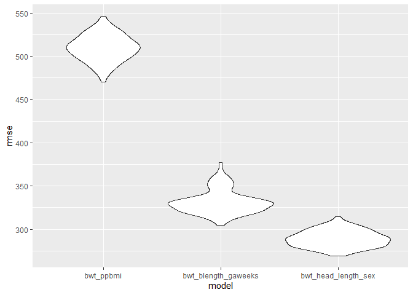

p8105_hw6_dr3168
================
Daniela Rochez
11/30/2021

``` r
library(tidyverse)
```

    ## -- Attaching packages --------------------------------------- tidyverse 1.3.1 --

    ## v ggplot2 3.3.5     v purrr   0.3.4
    ## v tibble  3.1.4     v dplyr   1.0.7
    ## v tidyr   1.1.4     v stringr 1.4.0
    ## v readr   2.0.2     v forcats 0.5.1

    ## -- Conflicts ------------------------------------------ tidyverse_conflicts() --
    ## x dplyr::filter() masks stats::filter()
    ## x dplyr::lag()    masks stats::lag()

``` r
library(modelr)
```

``` r
child_birthweight_df=read_csv("data/birthweight.csv")
```

    ## Rows: 4342 Columns: 20

    ## -- Column specification --------------------------------------------------------
    ## Delimiter: ","
    ## dbl (20): babysex, bhead, blength, bwt, delwt, fincome, frace, gaweeks, malf...

    ## 
    ## i Use `spec()` to retrieve the full column specification for this data.
    ## i Specify the column types or set `show_col_types = FALSE` to quiet this message.

``` r
child_birthweight_df=
  child_birthweight_df %>% 
  janitor::clean_names() %>% 
  mutate(babysex=
           recode(
             babysex,"1"= "male", "2"="female")) %>%
  mutate(frace=recode(frace, 
                      "1"= "white", "2"="black",
                      "3"="asian","4"="puerto_rican",
                      "8"="other", "9"="unknown"))%>%
  mutate(malform=
           recode(malform,"1"= "present",
                  "0"="absent")) %>% 
  mutate(mrace=recode(mrace, 
                      "1"= "white", "2"="black",
                      "3"="asian","4"="puerto_rican",
                      "8"="other")) %>% 
  mutate(babysex=as.factor(babysex),
         frace=as.factor(frace),
         mrace=as.factor(mrace),
         malform= as.factor(malform),
         momage=as.factor(momage))
```

Creating Linear Model

``` r
lm_bwt_ppbmi = lm(bwt ~ ppbmi+babysex, data = child_birthweight_df)

child_birthweight_df %>% 
  add_residuals(lm_bwt_ppbmi) %>%
  add_predictions(lm_bwt_ppbmi) %>% 
  ggplot(aes(x = pred, y = resid))+ geom_point()
```

<!-- -->

Cross Validation

``` r
cv_bwt_df=
  crossv_mc(child_birthweight_df, 100) %>% 
    mutate(
    train = map(train, as_tibble),
    test = map(test, as_tibble))
```

``` r
cv_bwt_df=
  cv_bwt_df %>% 
   mutate(
     lm_bwt_ppbmi = 
       map(train, ~lm(bwt ~ ppbmi+babysex, 
                      data = .x)),
     lm_bwt_blength_gaweeks=
       map(train, ~lm(bwt ~ blength+gaweeks, 
                      data = .x)),
     lm_bwt_head_length_sex= 
       map(train, ~lm(bwt~bhead*blength*babysex,
                      data = .x))) %>% 
    mutate(
      rmse_bwt_ppbmi=
        map2_dbl(lm_bwt_ppbmi, test, 
                 ~rmse(model= .x, data = .y)),
      rmse_bwt_blength_gaweeks=
        map2_dbl(lm_bwt_blength_gaweeks, test, 
                 ~rmse(model= .x, data = .y)),
      rmse_bwt_head_length_sex=
        map2_dbl(lm_bwt_head_length_sex, test, 
                 ~rmse(model= .x, data = .y)))
```

``` r
cv_bwt_df%>% 
  select(starts_with("rmse")) %>% 
  pivot_longer(
    everything(),
    names_to = "model", 
    values_to = "rmse",
    names_prefix = "rmse_") %>% 
  mutate(model = fct_inorder(model)) %>% 
  ggplot(aes(x = model, y = rmse)) + geom_violin()
```

<!-- -->
