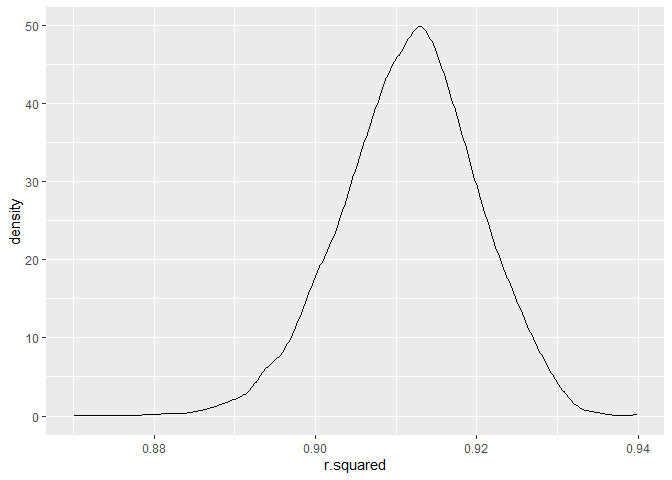
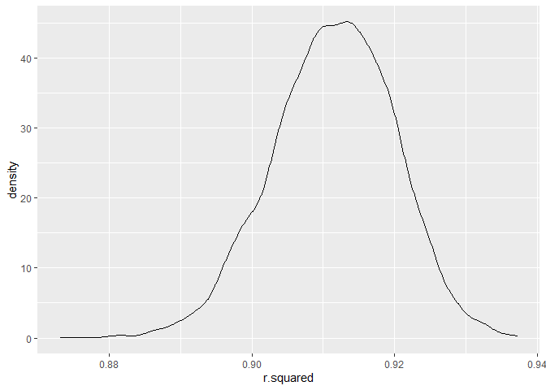

p8105_hw6_dr3168
================
Daniela Rochez
11/30/2021

``` r
library(tidyverse)
```

    ## -- Attaching packages --------------------------------------- tidyverse 1.3.1 --

    ## v ggplot2 3.3.5     v purrr   0.3.4
    ## v tibble  3.1.4     v dplyr   1.0.7
    ## v tidyr   1.1.4     v stringr 1.4.0
    ## v readr   2.0.2     v forcats 0.5.1

    ## -- Conflicts ------------------------------------------ tidyverse_conflicts() --
    ## x dplyr::filter() masks stats::filter()
    ## x dplyr::lag()    masks stats::lag()

``` r
library(modelr)
```

``` r
child_birthweight_df=read_csv("data/birthweight.csv")
```

    ## Rows: 4342 Columns: 20

    ## -- Column specification --------------------------------------------------------
    ## Delimiter: ","
    ## dbl (20): babysex, bhead, blength, bwt, delwt, fincome, frace, gaweeks, malf...

    ## 
    ## i Use `spec()` to retrieve the full column specification for this data.
    ## i Specify the column types or set `show_col_types = FALSE` to quiet this message.

``` r
child_birthweight_df=
  child_birthweight_df %>% 
  janitor::clean_names() %>% 
  mutate(babysex=
           recode(
             babysex,"1"= "male", "2"="female")) %>%
  mutate(frace=recode(frace, 
                      "1"= "white", "2"="black",
                      "3"="asian","4"="puerto_rican",
                      "8"="other", "9"="unknown"))%>%
  mutate(malform=
           recode(malform,"1"= "present",
                  "0"="absent")) %>% 
  mutate(mrace=recode(mrace, 
                      "1"= "white", "2"="black",
                      "3"="asian","4"="puerto_rican",
                      "8"="other")) %>% 
  mutate(babysex=as.factor(babysex),
         frace=as.factor(frace),
         mrace=as.factor(mrace),
         malform= as.factor(malform),
         momage=as.factor(momage))
```

Creating Linear Model

``` r
lm_bwt_ppbmi = lm(bwt ~ ppbmi+babysex, data = child_birthweight_df)

child_birthweight_df %>% 
  add_residuals(lm_bwt_ppbmi) %>%
  add_predictions(lm_bwt_ppbmi) %>% 
  ggplot(aes(x = pred, y = resid))+ geom_point()
```

<!-- -->

Cross Validation

``` r
cv_bwt_df=
  crossv_mc(child_birthweight_df, 100) %>% 
    mutate(
    train = map(train, as_tibble),
    test = map(test, as_tibble))
```

``` r
cv_bwt_df=
  cv_bwt_df %>% 
   mutate(
     lm_bwt_ppbmi = 
       map(train, ~lm(bwt ~ ppbmi+babysex, 
                      data = .x)),
     lm_bwt_blength_gaweeks=
       map(train, ~lm(bwt ~ blength+gaweeks, 
                      data = .x)),
     lm_bwt_head_length_sex= 
       map(train, ~lm(bwt~bhead*blength*babysex,
                      data = .x))) %>% 
    mutate(
      rmse_bwt_ppbmi=
        map2_dbl(lm_bwt_ppbmi, test, 
                 ~rmse(model= .x, data = .y)),
      rmse_bwt_blength_gaweeks=
        map2_dbl(lm_bwt_blength_gaweeks, test, 
                 ~rmse(model= .x, data = .y)),
      rmse_bwt_head_length_sex=
        map2_dbl(lm_bwt_head_length_sex, test, 
                 ~rmse(model= .x, data = .y)))
```

``` r
cv_bwt_df%>% 
  select(starts_with("rmse")) %>% 
  pivot_longer(
    everything(),
    names_to = "model", 
    values_to = "rmse",
    names_prefix = "rmse_") %>% 
  mutate(model = fct_inorder(model)) %>% 
  ggplot(aes(x = model, y = rmse)) + geom_violin()
```

<!-- -->

Problem 2

``` r
weather_df = 
  rnoaa::meteo_pull_monitors(
    c("USW00094728"),
    var = c("PRCP", "TMIN", "TMAX"), 
    date_min = "2017-01-01",
    date_max = "2017-12-31") %>%
  mutate(
    name = recode(id, USW00094728 = "CentralPark_NY"),
    tmin = tmin / 10,
    tmax = tmax / 10) %>%
  select(name, id, everything())
```

    ## Registered S3 method overwritten by 'hoardr':
    ##   method           from
    ##   print.cache_info httr

    ## using cached file: C:\Users\Daniela\AppData\Local/Cache/R/noaa_ghcnd/USW00094728.dly

    ## date created (size, mb): 2021-10-05 10:31:25 (7.617)

    ## file min/max dates: 1869-01-01 / 2021-10-31

Creating Bootstrap function

``` r
boot_sample = function(df) {
  sample_frac(df, replace = TRUE)}
```

Drawing Samples

``` r
boot_straps = 
  data_frame(
    strap_number = 1:5000,
    strap_sample = rerun(5000, boot_sample(weather_df )))
```

    ## Warning: `data_frame()` was deprecated in tibble 1.1.0.
    ## Please use `tibble()` instead.
    ## This warning is displayed once every 8 hours.
    ## Call `lifecycle::last_lifecycle_warnings()` to see where this warning was generated.

``` r
boot_straps
```

    ## # A tibble: 5,000 x 2
    ##    strap_number strap_sample      
    ##           <int> <list>            
    ##  1            1 <tibble [365 x 6]>
    ##  2            2 <tibble [365 x 6]>
    ##  3            3 <tibble [365 x 6]>
    ##  4            4 <tibble [365 x 6]>
    ##  5            5 <tibble [365 x 6]>
    ##  6            6 <tibble [365 x 6]>
    ##  7            7 <tibble [365 x 6]>
    ##  8            8 <tibble [365 x 6]>
    ##  9            9 <tibble [365 x 6]>
    ## 10           10 <tibble [365 x 6]>
    ## # ... with 4,990 more rows

Checking to see if it works

``` r
boot_straps %>% 
  filter(strap_number %in% 1:2) %>% 
  mutate(strap_sample = map(strap_sample, ~arrange(.x, tmin))) %>% 
  pull(strap_sample)
```

    ## [[1]]
    ## # A tibble: 365 x 6
    ##    name           id          date        prcp  tmax  tmin
    ##    <chr>          <chr>       <date>     <dbl> <dbl> <dbl>
    ##  1 CentralPark_NY USW00094728 2017-12-31     0  -6   -12.7
    ##  2 CentralPark_NY USW00094728 2017-12-31     0  -6   -12.7
    ##  3 CentralPark_NY USW00094728 2017-12-29     0  -5.5 -11.6
    ##  4 CentralPark_NY USW00094728 2017-12-29     0  -5.5 -11.6
    ##  5 CentralPark_NY USW00094728 2017-03-05     0   2.8  -9.9
    ##  6 CentralPark_NY USW00094728 2017-01-09     0  -4.9  -9.9
    ##  7 CentralPark_NY USW00094728 2017-01-09     0  -4.9  -9.9
    ##  8 CentralPark_NY USW00094728 2017-01-08     0  -3.8  -8.8
    ##  9 CentralPark_NY USW00094728 2017-03-11     0  -1.6  -8.2
    ## 10 CentralPark_NY USW00094728 2017-12-30    13  -4.9  -8.2
    ## # ... with 355 more rows
    ## 
    ## [[2]]
    ## # A tibble: 365 x 6
    ##    name           id          date        prcp  tmax  tmin
    ##    <chr>          <chr>       <date>     <dbl> <dbl> <dbl>
    ##  1 CentralPark_NY USW00094728 2017-12-29     0  -5.5 -11.6
    ##  2 CentralPark_NY USW00094728 2017-12-28     0  -7.7 -11.6
    ##  3 CentralPark_NY USW00094728 2017-01-08     0  -3.8  -8.8
    ##  4 CentralPark_NY USW00094728 2017-01-08     0  -3.8  -8.8
    ##  5 CentralPark_NY USW00094728 2017-03-11     0  -1.6  -8.2
    ##  6 CentralPark_NY USW00094728 2017-12-27     0  -4.3  -8.2
    ##  7 CentralPark_NY USW00094728 2017-12-30    13  -4.9  -8.2
    ##  8 CentralPark_NY USW00094728 2017-12-30    13  -4.9  -8.2
    ##  9 CentralPark_NY USW00094728 2017-02-10     0   0    -7.1
    ## 10 CentralPark_NY USW00094728 2017-03-12     0  -1.6  -7.1
    ## # ... with 355 more rows

Looking at nested data, fitting the model, tidying the data, unnesting
the data

``` r
bootstrap_results = 
  boot_straps %>% 
  mutate(
    models = map(strap_sample, 
                 ~lm(tmax ~ tmin, data = .x) ),
    results_tidy= map(models, broom::tidy),
    results_glance= map(models, broom::glance)) %>% 
  select(-strap_sample, -models) %>% 
  unnest(results_glance) %>% 
  unnest(results_tidy, names_repair = "unique")
```

    ## New names:
    ## * statistic -> statistic...5
    ## * p.value -> p.value...6
    ## * statistic -> statistic...10
    ## * p.value -> p.value...11

CI for Log B0 and B1

``` r
bootstrap_results %>% 
  group_by(strap_number) %>%
  summarize(log_b0_b1 = prod(estimate)) %>% 
  mutate(log_b0_b1= log(log_b0_b1)) %>% 
  summarize(
    ci_lower = quantile(log_b0_b1, 0.025), 
    ci_upper = quantile(log_b0_b1, 0.975))
```

    ## # A tibble: 1 x 2
    ##   ci_lower ci_upper
    ##      <dbl>    <dbl>
    ## 1     1.96     2.06

CI for R Squared

``` r
bootstrap_results %>% 
   summarize(
    ci_lower = quantile(r.squared, 0.025), 
    ci_upper = quantile(r.squared, 0.975))
```

    ## # A tibble: 1 x 2
    ##   ci_lower ci_upper
    ##      <dbl>    <dbl>
    ## 1    0.895    0.927

Creating distribution of log estimates

``` r
bootstrap_results %>% 
  group_by(strap_number) %>%
  summarize(log_b0_b1 = prod(estimate)) %>% 
  mutate(log_b0_b1= log(log_b0_b1)) %>% 
 ggplot(aes(x = log_b0_b1)) + geom_density()
```

<!-- -->
Creating distribution of r squared estimates

``` r
bootstrap_results %>% 
 ggplot(aes(x = r.squared)) + geom_density()
```

<!-- -->
